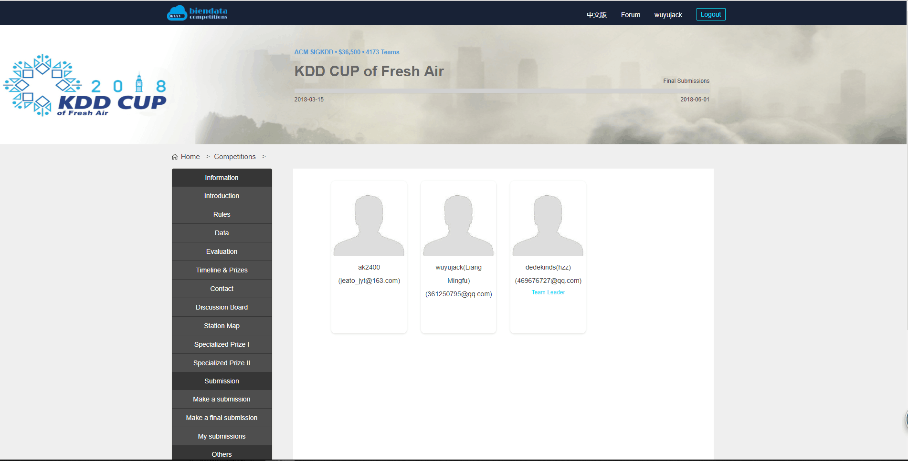

# 2018-ACM-SIGKDD-CUP-of-Fresh-Air-Solution
My team's (保O冲M) solution of 2018 ACM SIGKDD CUP of Fresh Air . We ranked 27/4188 in [final Leaderboard](https://biendata.com/competition/kdd_2018/ranking_list/).

You can also refer to my teammates' github: 

  wuyujack(Liang Mingfu): [wuyujack](https://github.com/wuyujack)

  dedekinds(hzz): [dedekinds](https://github.com/dedekinds)

  ak2400: [chaing233](https://github.com/chaing233)

Here is our submission record from April 1st, 2018 to May 31st, 2018:

  

Here is our teammates id for verification:

  

